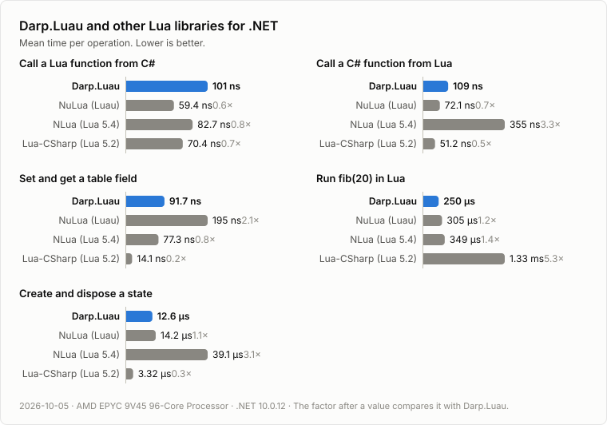
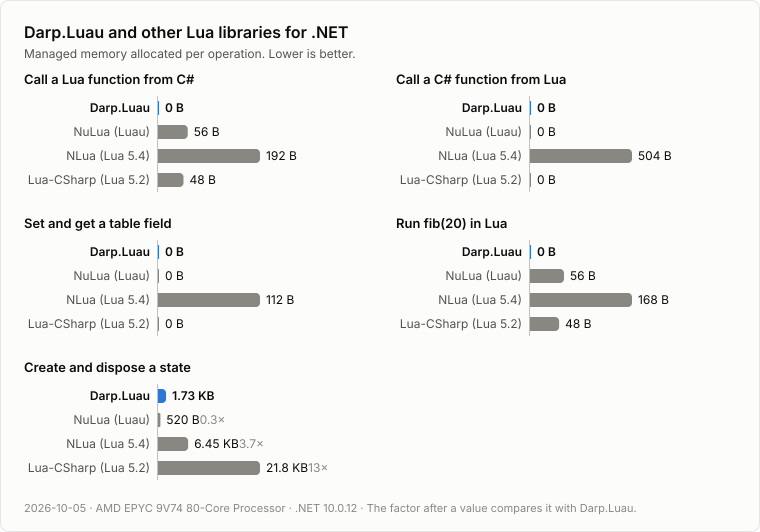

# Benchmark results

[Benchmarks](https://github.com/rosslight/Darp.Luau/tree/main/benchmarks) at commit [`6fb84ac`](https://github.com/rosslight/Darp.Luau/commit/6fb84ac52c5789871e55db22fd4ba98defd63316), measured in [this run](https://github.com/rosslight/Darp.Luau/actions/runs/37345091502) on a GitHub-hosted runner.





## All measurements

```

BenchmarkDotNet v0.15.8, Linux Ubuntu 24.04.5 LTS (Noble Numbat)
AMD EPYC 9V45 4.39GHz, 1 CPU, 4 logical and 2 physical cores
.NET SDK 10.0.401
  [Host]     : .NET 10.0.12 (10.0.12, 10.0.1226.42308), X64 RyuJIT x86-64-v4
  DefaultJob : .NET 10.0.12 (10.0.12, 10.0.1226.42308), X64 RyuJIT x86-64-v4


```
| Method                        | Categories           | Mean            | Error        | StdDev       | Gen0   | Gen1   | Gen2   | Allocated |
|------------------------------ |--------------------- |----------------:|-------------:|-------------:|-------:|-------:|-------:|----------:|
| &#39;Create and dispose a state&#39;  | Darp.Luau            |    12,571.75 ns |    91.678 ns |    85.756 ns | 0.0916 | 0.0305 | 0.0153 |    1768 B |
| &#39;Call a Lua function from C#&#39; | Darp.Luau            |       101.41 ns |     0.196 ns |     0.173 ns |      - |      - |      - |         - |
| &#39;Call a C# function from Lua&#39; | Darp.Luau            |       108.52 ns |     0.378 ns |     0.335 ns |      - |      - |      - |         - |
| &#39;Set and get a table field&#39;   | Darp.Luau            |        91.67 ns |     0.136 ns |     0.121 ns |      - |      - |      - |         - |
| &#39;Run fib(20) in Lua&#39;          | Darp.Luau            |   250,300.06 ns | 4,900.034 ns | 4,583.495 ns |      - |      - |      - |         - |
| &#39;Create and dispose a state&#39;  | Lua-CSharp (Lua 5.2) |     3,323.05 ns |     8.043 ns |     7.130 ns | 1.3351 | 0.0916 |      - |   22344 B |
| &#39;Call a Lua function from C#&#39; | Lua-CSharp (Lua 5.2) |        70.41 ns |     0.077 ns |     0.064 ns | 0.0029 |      - |      - |      48 B |
| &#39;Call a C# function from Lua&#39; | Lua-CSharp (Lua 5.2) |        51.17 ns |     0.044 ns |     0.037 ns |      - |      - |      - |         - |
| &#39;Set and get a table field&#39;   | Lua-CSharp (Lua 5.2) |        14.11 ns |     0.027 ns |     0.021 ns |      - |      - |      - |         - |
| &#39;Run fib(20) in Lua&#39;          | Lua-CSharp (Lua 5.2) | 1,327,387.92 ns | 2,550.828 ns | 2,261.243 ns |      - |      - |      - |      48 B |
| &#39;Create and dispose a state&#39;  | NLua (Lua 5.4)       |    39,072.00 ns |   223.487 ns |   174.484 ns | 0.3662 |      - |      - |    6608 B |
| &#39;Call a Lua function from C#&#39; | NLua (Lua 5.4)       |        82.69 ns |     0.344 ns |     0.288 ns | 0.0114 |      - |      - |     192 B |
| &#39;Call a C# function from Lua&#39; | NLua (Lua 5.4)       |       355.48 ns |     2.471 ns |     2.311 ns | 0.0293 |      - |      - |     504 B |
| &#39;Set and get a table field&#39;   | NLua (Lua 5.4)       |        77.34 ns |     0.272 ns |     0.241 ns | 0.0067 |      - |      - |     112 B |
| &#39;Run fib(20) in Lua&#39;          | NLua (Lua 5.4)       |   349,330.67 ns | 2,093.022 ns | 1,747.768 ns |      - |      - |      - |     168 B |
| &#39;Create and dispose a state&#39;  | NuLua (Luau)         |    14,155.01 ns |    58.517 ns |    54.736 ns | 0.0305 |      - |      - |     520 B |
| &#39;Call a Lua function from C#&#39; | NuLua (Luau)         |        59.39 ns |     0.197 ns |     0.164 ns | 0.0033 |      - |      - |      56 B |
| &#39;Call a C# function from Lua&#39; | NuLua (Luau)         |        72.12 ns |     0.119 ns |     0.112 ns |      - |      - |      - |         - |
| &#39;Set and get a table field&#39;   | NuLua (Luau)         |       195.06 ns |     0.307 ns |     0.256 ns |      - |      - |      - |         - |
| &#39;Run fib(20) in Lua&#39;          | NuLua (Luau)         |   305,128.98 ns | 4,763.128 ns | 4,455.433 ns |      - |      - |      - |      56 B |
