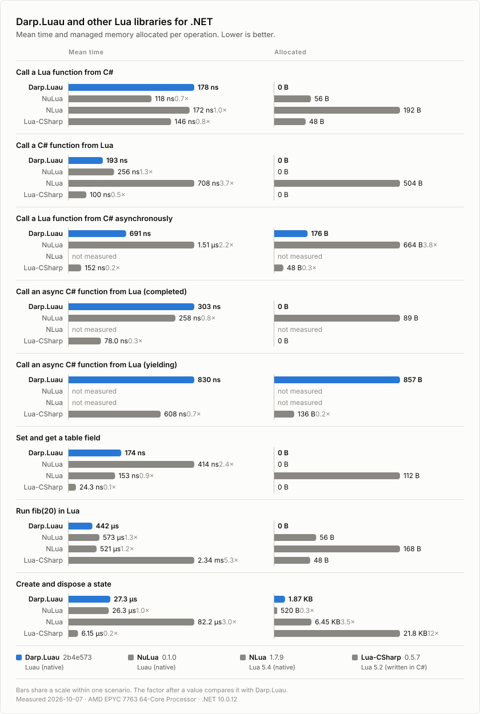

# Benchmark results

[Benchmarks](https://github.com/rosslight/Darp.Luau/tree/main/benchmarks) at commit [`9507d92`](https://github.com/rosslight/Darp.Luau/commit/9507d92c7c4a2f2bc52af7e773fc79afbddd9514), measured in [this run](https://github.com/rosslight/Darp.Luau/actions/runs/37823430155) on a GitHub-hosted runner.



## All measurements

```

BenchmarkDotNet v0.15.8, Linux Ubuntu 24.04.5 LTS (Noble Numbat)
AMD EPYC 7763 3.24GHz, 1 CPU, 4 logical and 2 physical cores
.NET SDK 10.0.401
  [Host]     : .NET 10.0.12 (10.0.12, 10.0.1226.42308), X64 RyuJIT x86-64-v3
  DefaultJob : .NET 10.0.12 (10.0.12, 10.0.1226.42308), X64 RyuJIT x86-64-v3


```
| Method                                           | Categories | Mean            | Error        | StdDev       | Gen0   | Gen1   | Allocated |
|------------------------------------------------- |----------- |----------------:|-------------:|-------------:|-------:|-------:|----------:|
| &#39;Create and dispose a state&#39;                     | Darp.Luau  |    26,842.29 ns |   111.238 ns |   104.052 ns | 0.0916 | 0.0305 |    1976 B |
| &#39;Call a Lua function from C#&#39;                    | Darp.Luau  |       183.08 ns |     0.337 ns |     0.298 ns |      - |      - |         - |
| &#39;Call a C# function from Lua&#39;                    | Darp.Luau  |       179.74 ns |     0.513 ns |     0.455 ns |      - |      - |         - |
| &#39;Call a Lua function from C# asynchronously&#39;     | Darp.Luau  |       527.95 ns |     1.299 ns |     1.084 ns |      - |      - |         - |
| &#39;Call an async C# function from Lua (completed)&#39; | Darp.Luau  |       237.24 ns |     0.241 ns |     0.201 ns |      - |      - |         - |
| &#39;Call an async C# function from Lua (yielding)&#39;  | Darp.Luau  |       689.61 ns |    13.565 ns |    21.119 ns | 0.0117 |      - |     201 B |
| &#39;Set and get a table field&#39;                      | Darp.Luau  |       181.64 ns |     0.377 ns |     0.353 ns |      - |      - |         - |
| &#39;Run fib(20) in Lua&#39;                             | Darp.Luau  |   457,175.50 ns | 1,226.393 ns | 1,087.166 ns |      - |      - |         - |
| &#39;Create and dispose a state&#39;                     | Lua-CSharp |     6,180.28 ns |   118.545 ns |   141.120 ns | 1.3351 | 0.0916 |   22344 B |
| &#39;Call a Lua function from C#&#39;                    | Lua-CSharp |       150.18 ns |     0.267 ns |     0.237 ns | 0.0029 |      - |      48 B |
| &#39;Call a C# function from Lua&#39;                    | Lua-CSharp |       101.74 ns |     0.065 ns |     0.051 ns |      - |      - |         - |
| &#39;Call a Lua function from C# asynchronously&#39;     | Lua-CSharp |       146.02 ns |     0.586 ns |     0.548 ns | 0.0029 |      - |      48 B |
| &#39;Call an async C# function from Lua (completed)&#39; | Lua-CSharp |        75.43 ns |     0.089 ns |     0.083 ns |      - |      - |         - |
| &#39;Call an async C# function from Lua (yielding)&#39;  | Lua-CSharp |       641.69 ns |     2.609 ns |     2.440 ns | 0.0078 |      - |     136 B |
| &#39;Set and get a table field&#39;                      | Lua-CSharp |        24.43 ns |     0.012 ns |     0.009 ns |      - |      - |         - |
| &#39;Run fib(20) in Lua&#39;                             | Lua-CSharp | 2,337,172.65 ns | 5,712.217 ns | 5,063.732 ns |      - |      - |      48 B |
| &#39;Create and dispose a state&#39;                     | NLua       |    81,141.63 ns |   248.499 ns |   220.288 ns | 0.3662 |      - |    6608 B |
| &#39;Call a Lua function from C#&#39;                    | NLua       |       188.56 ns |     0.511 ns |     0.478 ns | 0.0114 |      - |     192 B |
| &#39;Call a C# function from Lua&#39;                    | NLua       |       717.35 ns |     1.986 ns |     1.761 ns | 0.0273 |      - |     504 B |
| &#39;Set and get a table field&#39;                      | NLua       |       160.62 ns |     1.726 ns |     1.530 ns | 0.0067 |      - |     112 B |
| &#39;Run fib(20) in Lua&#39;                             | NLua       |   570,175.71 ns | 5,868.875 ns | 5,489.749 ns |      - |      - |     168 B |
| &#39;Create and dispose a state&#39;                     | NuLua      |    26,160.39 ns |    47.644 ns |    44.566 ns | 0.0305 |      - |     520 B |
| &#39;Call a Lua function from C#&#39;                    | NuLua      |       122.70 ns |     0.787 ns |     0.697 ns | 0.0033 |      - |      56 B |
| &#39;Call a C# function from Lua&#39;                    | NuLua      |       255.06 ns |     0.755 ns |     0.669 ns |      - |      - |         - |
| &#39;Call a Lua function from C# asynchronously&#39;     | NuLua      |     1,490.66 ns |    29.573 ns |    37.401 ns | 0.0381 | 0.0362 |     664 B |
| &#39;Call an async C# function from Lua (completed)&#39; | NuLua      |       260.43 ns |     0.574 ns |     0.537 ns | 0.0049 | 0.0010 |      89 B |
| &#39;Set and get a table field&#39;                      | NuLua      |       413.65 ns |     0.170 ns |     0.133 ns |      - |      - |         - |
| &#39;Run fib(20) in Lua&#39;                             | NuLua      |   569,818.70 ns |   481.559 ns |   402.123 ns |      - |      - |      56 B |
